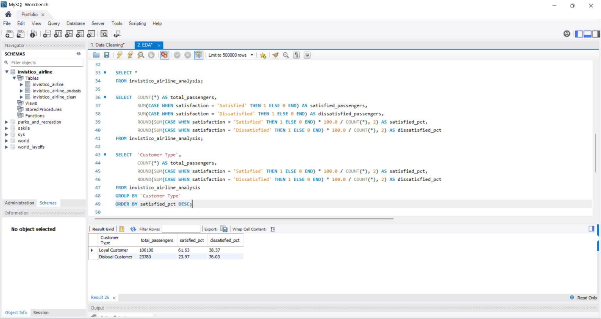
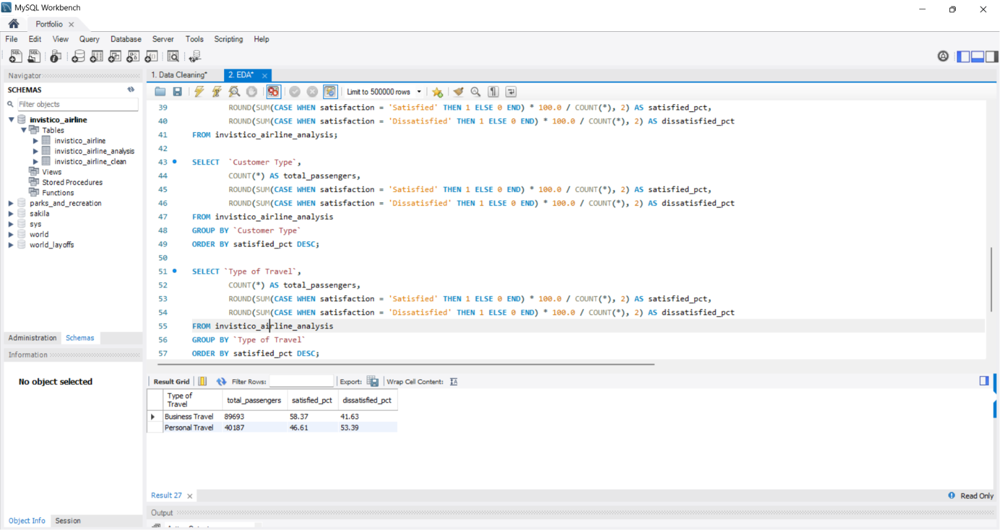
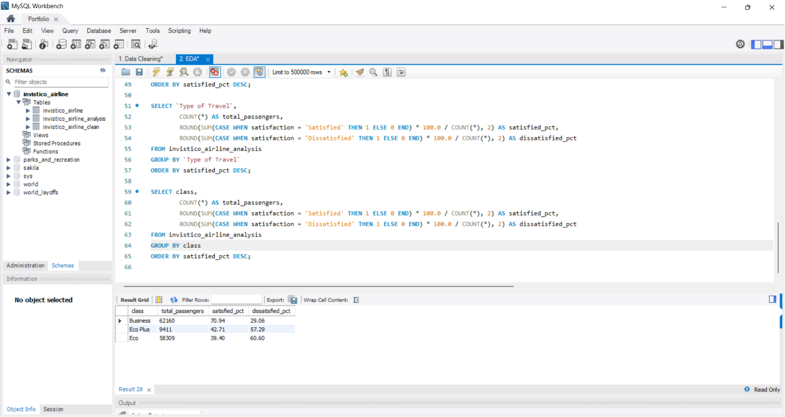
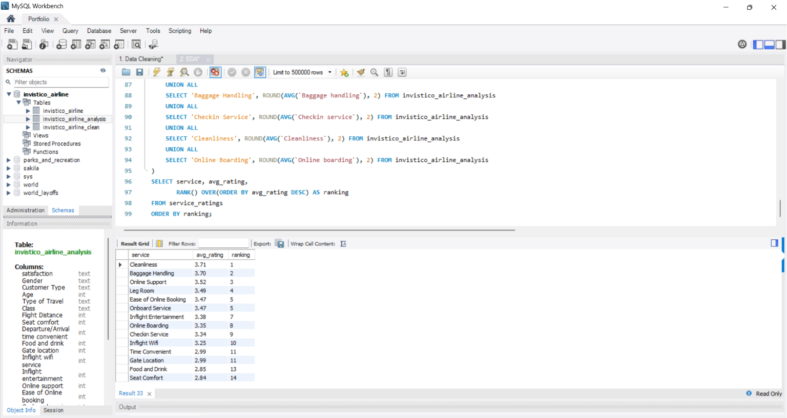
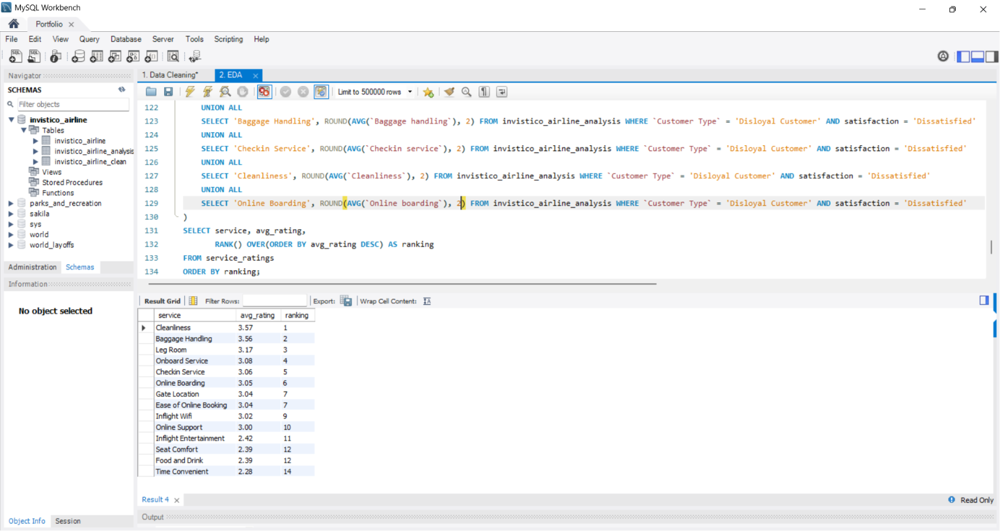
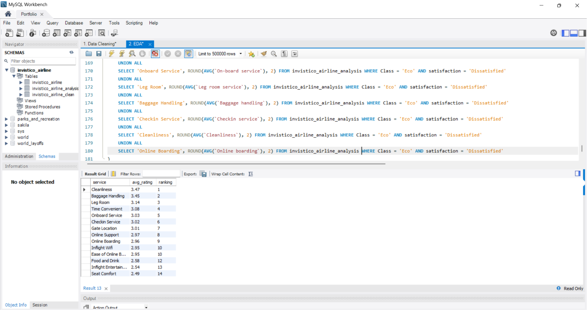
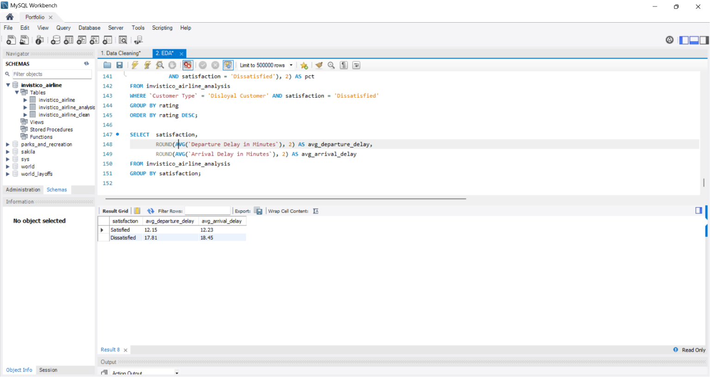

# Invistico_Airline
Using MySQL to analyze Invistico Airline passenger satisfaction data 
to find out what makes passengers satisfied or dissatisfied, covering 
service ratings, customer types and flight classes.

## Executive Summary

This analysis explores passenger satisfaction data from Invistico 
Airline, covering **129,880** passengers across different customer 
types, travel types, flight classes and service ratings.

Overall, **54.73%** of passengers are satisfied while **45.27%** 
are dissatisfied. The gap is narrow enough to be a serious concern 
for the airline. Loyal customers and business travellers tend to 
be more satisfied, while disloyal customers and personal travellers 
in Eco class are the most unhappy groups.

The analysis found that Seat Comfort, Food and Drink and Inflight 
Entertainment are consistently the lowest rated services across 
all groups. Disloyal passengers have a dissatisfaction rate of 
**76.03%**, making them the most critical group to address if the 
airline wants to grow its loyal customer base. Eco class passengers 
also show a high dissatisfaction rate of **60.60%** despite being 
the second largest passenger group in the dataset.

## Dataset Overview

The dataset contains passenger satisfaction survey data from Invistico 
Airline. It covers various aspects of the passenger experience including 
service ratings, flight details, and customer profile information.

One thing worth noting is that the service rating columns use a scale 
of 1 to 5, where 1 is the lowest and 5 is the highest. A rating of 0 
may indicate that the passenger did not rate that particular service.

The raw dataset used in this analysis can be downloaded [here](Invistico_Airline.csv).

The dataset was obtained from Kaggle.

| Column | Description |
|---|---|
| `satisfaction` | Overall passenger satisfaction (Satisfied or Dissatisfied) |
| `Gender` | Passenger gender |
| `Customer Type` | Loyal or Disloyal Customer |
| `Age` | Passenger age |
| `Type of Travel` | Business Travel or Personal Travel |
| `Class` | Flight class (Business, Eco, Eco Plus) |
| `Flight Distance` | Distance of the flight in miles |
| `Seat comfort` | Seat comfort rating (1-5) |
| `Departure/Arrival time convenient` | Rating for departure and arrival time convenience (1-5) |
| `Food and drink` | Food and drink rating (1-5) |
| `Gate location` | Gate location rating (1-5) |
| `Inflight wifi service` | Inflight wifi rating (1-5) |
| `Inflight entertainment` | Inflight entertainment rating (1-5) |
| `Online support` | Online support rating (1-5) |
| `Ease of Online booking` | Ease of online booking rating (1-5) |
| `On-board service` | On-board service rating (1-5) |
| `Leg room service` | Leg room rating (1-5) |
| `Baggage handling` | Baggage handling rating (1-5) |
| `Checkin service` | Check-in service rating (1-5) |
| `Cleanliness` | Cleanliness rating (1-5) |
| `Online boarding` | Online boarding rating (1-5) |
| `Departure Delay in Minutes` | Departure delay in minutes |
| `Arrival Delay in Minutes` | Arrival delay in minutes |

## Analysis & Findings

### Satisfaction by Customer Profile

#### **By Customer Type**

61.63% of loyal customers are satisfied with Invistico Airline's 
services. However, nearly 3 out of 4 disloyal passengers have a 
negative experience with the airline with a dissatisfaction rate 
of 76.03%, which makes it very difficult for the airline to 
convert them into loyal customers.

#### **By Travel Type**

Business travellers are mostly satisfied at **58.37%** while 
personal travellers are mostly dissatisfied at **53.39%**. 
This suggests the airline is better at serving business travellers 
than leisure ones.

#### **By Class**

Business class has the highest satisfaction rate at **70.94%**. 
Eco Plus and Eco class tell a different story with dissatisfaction 
rates of **57.29%** and **60.60%** respectively. This also aligns 
with the travel type finding where business travellers who mostly 
fly in Business class are better served, while personal travellers 
who mostly fly in Eco class are left with a poorer experience.

### Service Rating Analysis

Overall, no service scored above **4.0** out of 5, which means 
no single service is truly excelling. Cleanliness and Baggage 
Handling are the highest rated services at **3.71** and **3.70** 
respectively, but still not impressive enough.

On the other end, Seat Comfort is the lowest rated service at 
**2.84**, followed by Food and Drink at **2.85** and Gate Location 
at **2.99**. These are core aspects of the passenger experience 
and their low ratings are likely one of the reasons behind the 
high dissatisfaction rate.

### Deep Dive: Disloyal Customer Dissatisfaction

Looking specifically at disloyal dissatisfied customers, the ratings 
are noticeably lower compared to the overall average. Here is the 
comparison:

- Time Convenient: **2.28** vs **2.99** overall
- Food and Drink: **2.39** vs **2.85** overall
- Seat Comfort: **2.39** vs **2.84** overall
- Inflight Entertainment: **2.42** vs **3.38** overall

These four services are the biggest pain points for disloyal 
passengers. Inflight Entertainment shows the biggest drop, suggesting 
that disloyal dissatisfied passengers are particularly unhappy with 
the in-flight experience compared to the average passenger. These 
are likely the key drivers behind the **76.03%** dissatisfaction 
rate in this group.

Interestingly, Gate Location which ranks among the lowest overall 
at **2.99**, is not a major concern for this group specifically. 
This suggests that the dissatisfaction among disloyal passengers 
is driven by specific in-flight experience factors rather than 
ground services like gate location.

### Deep Dive: Eco Class Dissatisfaction

Looking at Eco class dissatisfied passengers, Seat Comfort is the 
lowest rated service at **2.49**, followed by Inflight Entertainment 
at **2.54** and Food and Drink at **2.58**. 

Notably, these three services also appeared at the bottom for 
disloyal dissatisfied passengers. This consistency across both 
groups suggests that Seat Comfort, Inflight Entertainment and 
Food and Drink are the most critical areas for the airline to 
address.

### Delay Analysis

Dissatisfied passengers experienced a higher average delay compared 
to satisfied ones. Departure delay averaged **17.81 minutes** for 
dissatisfied passengers versus **12.15 minutes** for satisfied ones. 
Similarly, arrival delay averaged **18.45 minutes** versus **12.23 
minutes**.

While the gap exists, the difference of around 5 to 6 minutes 
suggests that delay alone is not the main driver of dissatisfaction. 
The low service ratings we saw earlier likely play a bigger role 
in the overall passenger experience.

## Recommendations

Based on the analysis, here are the key recommendations for 
Invistico Airline:

- **Prioritise Seat Comfort, Food and Drink and Inflight 
  Entertainment**: These three services consistently ranked 
  at the bottom across both disloyal dissatisfied passengers 
  and Eco class dissatisfied passengers. Improving these areas 
  would have the biggest impact on overall satisfaction since 
  they affect the largest groups of unhappy passengers.

- **Focus on converting disloyal customers**: Nearly 3 out 
  of 4 disloyal passengers leave dissatisfied. Since these are 
  first time or non-member passengers, a poor experience means 
  they are unlikely to return. Improving the overall experience 
  for this group is key to growing the airline's loyal customer 
  base.

- **Improve Eco class experience**: With **58,309** passengers 
  and a dissatisfaction rate of **60.60%**, Eco class represents 
  the biggest opportunity for improvement. Better seat comfort, 
  food quality and inflight entertainment in economy would 
  directly address the majority of dissatisfied passengers.

- **Review flight schedule options**: Time Convenient is the 
  lowest rated service among disloyal dissatisfied passengers at 
  **2.28**. This suggests passengers are unhappy with the available 
  departure and arrival times. Offering more flexible flight 
  schedules could help improve satisfaction for this group.

---

## Data Cleaning
Before doing the analysis, I performed data cleaning to ensure the 
dataset is accurate and ready for analysis. Below are the steps I took:

### Raw Dataset
Below is a screenshot of the raw dataset after being imported 
into MySQL from CSV format.

### 1. Removing Duplicates

I used `ROW_NUMBER()` to check for duplicates by partitioning records 
that share the same values across all columns. Any record assigned a 
row number greater than 1 would be considered a duplicate and removed. 
After running the check, no duplicates were found in this dataset.

### 2. Standardizing Data

I checked all text columns for inconsistent spellings and formatting 
using `SELECT DISTINCT`. No spelling inconsistencies were found. 
However, some values had inconsistent capitalization where the first 
letter was not in uppercase. I corrected these to ensure the data 
looks clean and consistent throughout the analysis.

*Before: Inconsistent capitalization*

*After: Consistent capitalization*

### 3. NULL Values & Blanks

I checked all columns for NULL and blank values. For numeric columns, 
blank values would typically be replaced with 0 since a missing rating 
or delay value most likely means none was recorded rather than unknown 
data. However, this dataset had no NULL or blank values so no action 
was required.

### 4. Data Types

Data types were defined manually during table creation before 
importing the dataset, so no type conversion was required.

