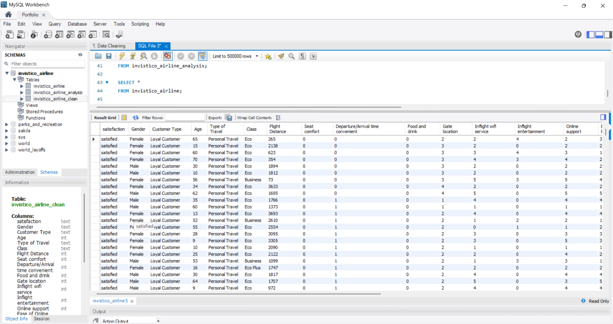
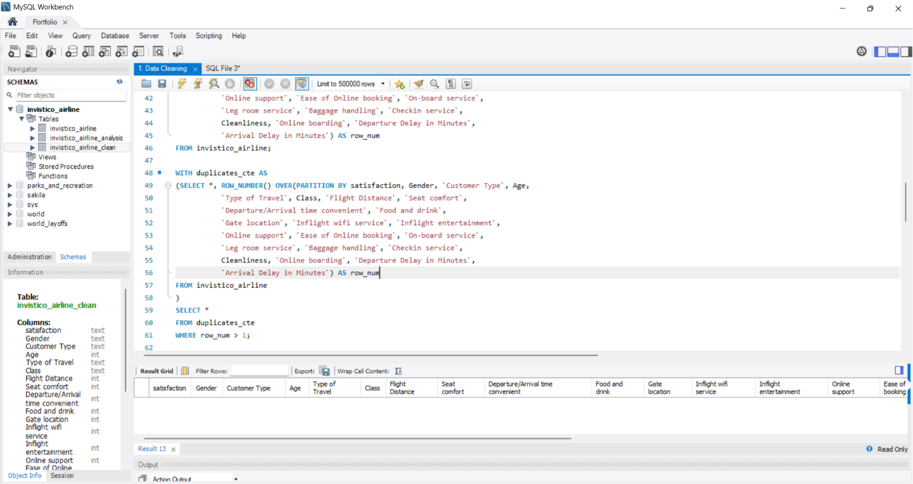
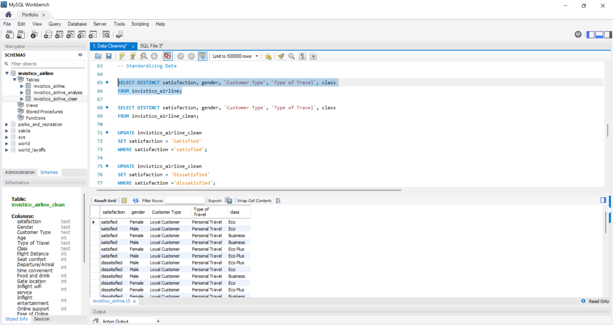
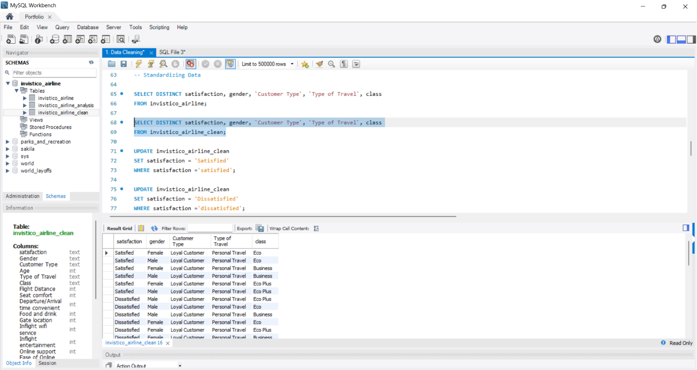
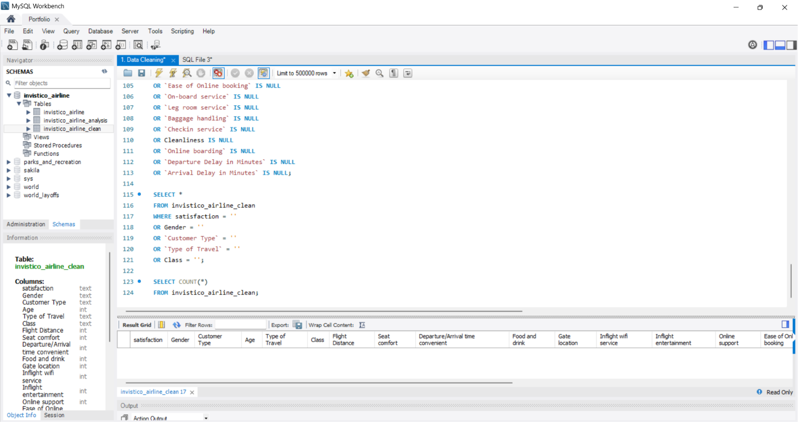
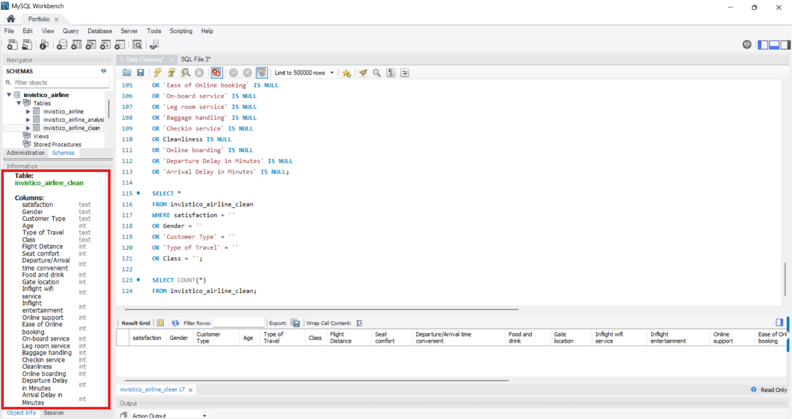

# Invistico_Airline
Using MySQL to analyze Invistico Airline passenger satisfaction data,  exploring service ratings such as food and drink, gate location,  and inflight entertainment to uncover what drives customer satisfaction.

## Executive Summary
*To be updated after analysis is complete.*

## Dataset Overview

The dataset contains passenger satisfaction survey data from Invistico 
Airline. It covers various aspects of the passenger experience including 
service ratings, flight details, and customer profile information.

One thing worth noting is that the service rating columns use a scale 
of 1 to 5, where 1 is the lowest and 5 is the highest. A rating of 0 
may indicate that the passenger did not rate that particular service.

The raw dataset used in this analysis can be downloaded [here](Invistico_Airline.csv).

The dataset was obtained from Kaggle.

| Column | Description |
|---|---|
| `satisfaction` | Overall passenger satisfaction (Satisfied or Dissatisfied) |
| `Gender` | Passenger gender |
| `Customer Type` | Loyal or Disloyal Customer |
| `Age` | Passenger age |
| `Type of Travel` | Business Travel or Personal Travel |
| `Class` | Flight class (Business, Eco, Eco Plus) |
| `Flight Distance` | Distance of the flight in miles |
| `Seat comfort` | Seat comfort rating (1-5) |
| `Departure/Arrival time convenient` | Rating for departure and arrival time convenience (1-5) |
| `Food and drink` | Food and drink rating (1-5) |
| `Gate location` | Gate location rating (1-5) |
| `Inflight wifi service` | Inflight wifi rating (1-5) |
| `Inflight entertainment` | Inflight entertainment rating (1-5) |
| `Online support` | Online support rating (1-5) |
| `Ease of Online booking` | Ease of online booking rating (1-5) |
| `On-board service` | On-board service rating (1-5) |
| `Leg room service` | Leg room rating (1-5) |
| `Baggage handling` | Baggage handling rating (1-5) |
| `Checkin service` | Check-in service rating (1-5) |
| `Cleanliness` | Cleanliness rating (1-5) |
| `Online boarding` | Online boarding rating (1-5) |
| `Departure Delay in Minutes` | Departure delay in minutes |
| `Arrival Delay in Minutes` | Arrival delay in minutes |

## Analysis & Findings

## Recommendations

## Data Cleaning
Before doing the analysis, I performed data cleaning to ensure the 
dataset is accurate and ready for analysis. Below are the steps I took:

### Raw Dataset
Below is a screenshot of the raw dataset after being imported 
into MySQL from CSV format.

### 1. Removing Duplicates

I used `ROW_NUMBER()` to check for duplicates by partitioning records 
that share the same values across all columns. Any record assigned a 
row number greater than 1 would be considered a duplicate and removed. 
After running the check, no duplicates were found in this dataset.

### 2. Standardizing Data

I checked all text columns for inconsistent spellings and formatting 
using `SELECT DISTINCT`. No spelling inconsistencies were found. 
However, some values had inconsistent capitalization where the first 
letter was not in uppercase. I corrected these to ensure the data 
looks clean and consistent throughout the analysis.

*Before: Inconsistent capitalization*

*After: Consistent capitalization*

### 3. NULL Values & Blanks

I checked all columns for NULL and blank values. For numeric columns, 
blank values would typically be replaced with 0 since a missing rating 
or delay value most likely means none was recorded rather than unknown 
data. However, this dataset had no NULL or blank values so no action 
was required.

### 4. Data Types

Data types were defined manually during table creation before 
importing the dataset, so no type conversion was required.

